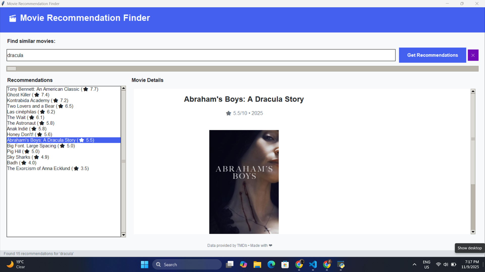

# 🎬 Movie Recommendation Finder

A modern **Tkinter-based desktop app** that helps you find **movie recommendations** using the [TMDb (The Movie Database)](https://www.themoviedb.org/) API.
Simply enter a movie name, and the app fetches similar films with details like posters, ratings, and overviews — all displayed in an elegant, scrollable interface.

---

## 🚀 Features

* 🔍 **Search any movie** by title
* 🎯 **Get up to 15 movie recommendations** based on the searched film
* 🖼️ **Display movie posters, ratings, release years, and overviews**
* 🎨 **Modern, responsive UI** with smooth scrolling and hover effects
* 💡 **Built-in error handling and retry mechanism** for API connectivity issues
* 🧵 **Background threading** for smooth user experience (no freezing UI)
* 🌈 **Custom color scheme and clean layout** using Tkinter and ttk

---

## 🧰 Tech Stack

* **Python 3.9+**
* **Tkinter** – for the GUI
* **Requests** – for making API calls
* **Pillow (PIL)** – for loading and resizing poster images
* **Threading** – for asynchronous API requests
* **dotenv** – for environment variable management
* **TMDb API** – for movie data and recommendations

---

## 🛠️ Installation & Setup

### 1️⃣ Clone the repository

```bash
(https://github.com/PusprajKumar000/Movie.git)
cd Movie
```

### 2️⃣ Create and activate a virtual environment

```bash
python -m venv venv
source venv/bin/activate    # On macOS/Linux
venv\Scripts\activate       # On Windows
```

### 3️⃣ Install required dependencies

```bash
pip install -r requirements.txt
```

### 4️⃣ Get your TMDb API key

* Go to [TMDb API](https://developer.themoviedb.org/docs/getting-started)
* Create an account and generate an API key

### 5️⃣ Create a `.env` file in the project root

```
TMDB_API_KEY=your_tmdb_api_key_here
```

### 6️⃣ Run the app

```bash
python movie.py
```

---

## 🖥️ Usage

1. Launch the app
2. Type a movie name (e.g., “Inception”)
3. Click **Get Recommendations**
4. View up to 15 recommended movies in the left panel
5. Click on a movie to see its **poster, rating, release year, and overview**

---

## 📸 Screenshots (Optional)



---

## ⚙️ Project Structure

```
movie-recommendation-finder/
│
├── movie.py          # Main application script
├── .env.example      # Example environment file
├── requirements.txt  # Dependencies list
└── README.md         # Documentation
```

---

## 📦 Example `requirements.txt`

```
requests
python-dotenv
pillow
```

*(Tkinter is built into Python — no need to install separately)*

---

## 🧠 Notes

* The app uses the **TMDb “recommendations” endpoint**, which finds similar movies based on TMDb’s internal algorithm.
* The API key is **required** for the app to function.
* Make sure your network allows HTTPS requests to `api.themoviedb.org`.

---

## ❤️ Credits

* **Data:** [TMDb API](https://developer.themoviedb.org/docs)
* **Developer:** Your Name ([@yourhandle](https://github.com/pusprajkumar000))

---

## 📄 License

This project is licensed under the MIT License — see the [LICENSE](LICENSE) file for details.

---

Would you like me to include a **`requirements.txt`** file and a **`.env.example`** template as well? I can generate them for you automatically.

